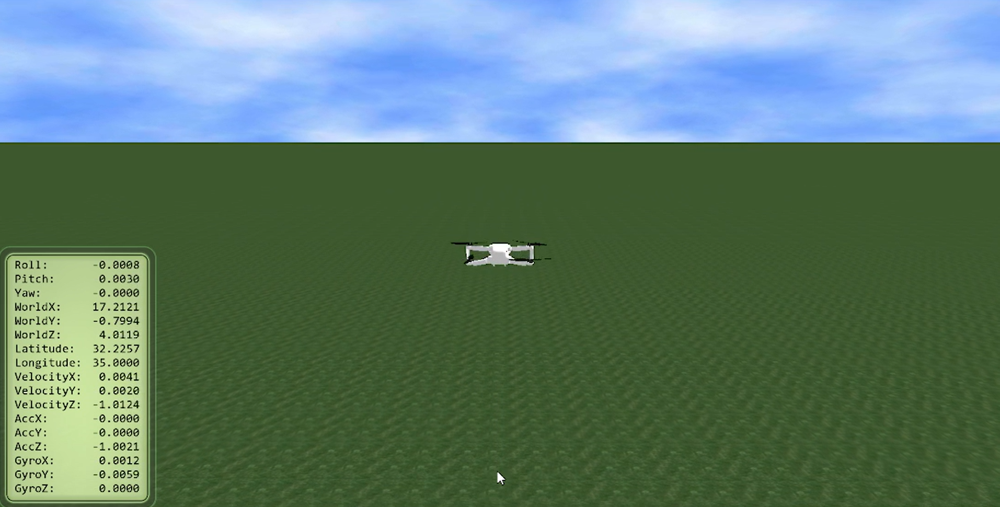
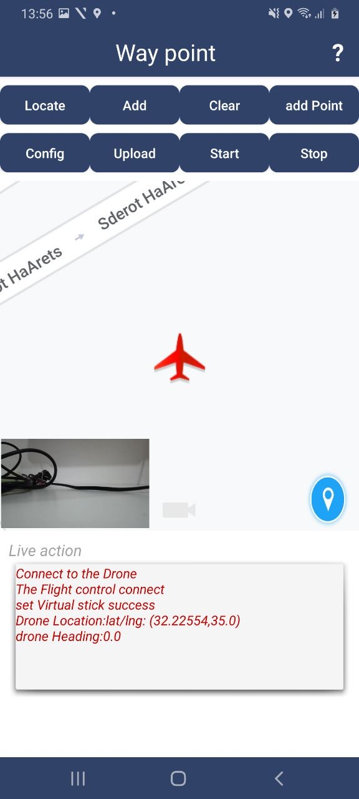

<h1 align="center"> Mini Drone Simulation </h1>

<br>


<h2 align="center"> <strong>Table Of Contents</strong></h2>


<br>


<p align="center">
  <a href="#introduction">Introduction</a> <br> <br>
  <a href="#features">Features</a> <br><br>
  <a href="#waypoint">Waypoint</a> <br><br>
  <a href="#how-does-the-drone-fly-autonomously-using-virtual-stick">How Does The Drone Fly Autonomously Using Virtual Stick</a> <br><br>
  <a href="#prerequisites">Prerequisites</a> <br><br>
  <a href="#how-to-run">How To Run</a> <br><br>
  <a href="#simulation">Simulation</a> <br>
</p>


<br>


<br>


<h2 align="center">Introduction</h2>


<br>


Welcome to the Mini Drone Simulation project, this repository is dedicated to the development and simulation of an autonomous mini drone. The primary goal of this project is to create a comprehensive environment where the drone can navigate autonomously using a variety of control algorithms.

> **_The project is applied on **`Mavic Mini 1`**, which originally does not support autonomous flights._**

<br>

<p align="center">
  
</p>


<br>


<h2 align="center">Features</h2>


<br>


:heavy_check_mark: _**Autonomously** navigating the drone towards destinations that are given before taking off, respectively._

:heavy_check_mark: _Freely choose which destination to navigate to - among all existing destinations._

:heavy_check_mark: _Dynamically set an existing destination (by dragging) to a new one during the drone's flight and navigates to it._

<br>

<div align="center">
  
  
</div>
  
<br>


- _The algorithmic logic behind this feature is as follows:_

  ```java
  onMarkerDragStart(@NonNull Marker marker)
  ```
  
    > **_Once dragging starts, it pauses the drone's current mission._**
    
  ```java
  onMarkerDrag(@NonNull Marker marker)
  ```
  
    > **_Continuously updates the current coordinate as long as the location marker (in Waypoint) is being dragged._**
    
  ```java
  onMarkerDragEnd(@NonNull Marker marker)
  ```
    
    > **_Once there is no longer dragging, updates the coordinate to be the new marker's coordinate after dragging and resumes mission._**


<br>


- _Where all 3 methods are integrated in the following **`MoveMarkerInRealTime()`**:_

  ```java
  private void MoveMarkerInRealTime(){
        Mymap.setOnMarkerDragListener(new GoogleMap.OnMarkerDragListener() {
            @Override
            public void onMarkerDragStart(@NonNull Marker marker) {
                getWaypointMissionOperator().PauseMission();

            }

            @Override
            public void onMarkerDrag(@NonNull Marker marker) {
                LocationCoordinate2D newCoordinate=new LocationCoordinate2D(marker.getPosition().latitude,marker.getPosition().longitude);
                getWaypointMissionOperator().updateWaypoint(newCoordinate);

            }

            @Override
            public void onMarkerDragEnd(@NonNull Marker marker) {
                LocationCoordinate2D newCoordinate = new LocationCoordinate2D(marker.getPosition().latitude, marker.getPosition().longitude);
                getWaypointMissionOperator().updateWaypoint(newCoordinate);
                getWaypointMissionOperator().resumeMission();

            }
        });
    }
  ```


<br>


<h2 align="center">Waypoint</h2>


<br>


**Waypoint** is an application that sets up the drone's flight before taking off, using various buttons where each one serves its own purpose.
Essentially, the feature where you can dynamically set a new destination, is highly relied on the Waypoint.

<p align="center">
  
</p>

How buttons work:

- **`LOCATE`** _Zooms in towards the red airplane displayed in the app (which is the drone' current position)._
- **`ADD`** _Adds a new destination by just clicking - in order to perform the click, the 'Add' button must be clicked_
- **`CLEAR`** _Clears all currently existing destinations._
- **`ADD POINT`** _Adds a new destination by providing latitude, longtitude and altitude._
- **`CONFIG`** _Configures/initializes the needed specifications for the flight, such as: speed, altitude, where-to-land... etc._
- **`UPLOAD`** _Uploads all filled settings for the Waypoint's mission so it can be ready to take off._
- **`START`** _Starts the mission, after uploading all needed settings._
  
    > **_Please note that only after starting your mission, you will be able to dynamically set a new destination._**
  
- **`STOP`** _Stops the mission._

<br>

> **Visit **`MavicMiniWaypoint.java`** for implementation details.**


<br>


<h2 align="center">How Does The Drone Fly Autonomously Using Virtual Stick</h2>


<br>


Essentially, **`MavicMiniMissionOperator.java`** is responsible to provide the autonomous algorithm, in particular, its relation with the observer:

  ```java
  private Observer<LocationCoordinate3D> locationObserver = new Observer<LocationCoordinate3D>() {
        @Override
        public void onChanged(LocationCoordinate3D currentLocation) {
            // Observing changes to the drone's location coordinates
            state = WaypointMissionState.EXECUTING;

            distanceToWaypoint = distanceInMeters(
                    new LocationCoordinate2D(currentWaypoint.coordinate.getLatitude(), currentWaypoint.coordinate.getLongitude()),
                    new LocationCoordinate2D(currentLocation.getLatitude(), currentLocation.getLongitude())
            );

            double longitudeDiff = currentWaypoint.coordinate.getLongitude() - currentLocation.getLongitude();
            double latitudeDiff = currentWaypoint.coordinate.getLatitude() - currentLocation.getLatitude();
            if(!isPausedForUpdate){
                pauseMission();
            }

            if (Math.abs(latitudeDiff) > originalLatitudeDiff) {
                originalLatitudeDiff = Math.abs(latitudeDiff);
            }

            if (Math.abs(longitudeDiff) > originalLongitudeDiff) {
                originalLongitudeDiff = Math.abs(longitudeDiff);
            }

            // Terminating the sendDataTimer and creating a new one
            sendDataTimer.cancel();
            sendDataTimer = new Timer();

            if (!travelledLongitude) {
                float speed = Math.max(
                        (float) (mission.getAutoFlightSpeed() * (Math.abs(longitudeDiff) / originalLongitudeDiff)),
                        0.5f
                );

                directions.pitch = longitudeDiff > 0 ? speed : -speed;
            }

            if (!travelledLatitude) {
                float speed = Math.max(
                        (float) (mission.getAutoFlightSpeed() * (Math.abs(latitudeDiff) / originalLatitudeDiff)),
                        0.5f
                );

                directions.roll = latitudeDiff > 0 ? speed : -speed;
            }

            // When the longitude difference becomes insignificant
            if (Math.abs(longitudeDiff) < 0.000002) {
                checkLong++;
                if(checkLong==1) {
                    textAppenderOper.appendTextAndScroll("finished travelling LONGITUDE");
                    Log.d(TAG, "finished travelling LONGITUDE");
                }
                directions.pitch = 0f;
                travelledLongitude = true;
            }

            if (Math.abs(latitudeDiff) < 0.000002) {
                CheckLat++;
                if(CheckLat==1) {
                    textAppenderOper.appendTextAndScroll("finished travelling LATITUDE");
                    Log.d(TAG, "finished travelling LATITUDE");
                }
                directions.roll = 0f;
                travelledLatitude = true;
            }

            // When the latitude difference becomes insignificant and there is no longitude difference
            if (travelledLatitude && travelledLongitude) {
                waypointTracker++;
                if (waypointTracker < waypoints.size()) {
                    currentWaypoint = waypoints.get(waypointTracker);
                    originalLatitudeDiff = -1.0;
                    originalLongitudeDiff = -1.0;
                    travelledLongitude = false;
                    travelledLatitude = false;
                    directions = new Direction(); // Assuming Direction is a class with an appropriate constructor
                } else {
                    state = WaypointMissionState.EXECUTION_STOPPING;
                    if (operatorListener != null) {
                        operatorListener.onExecutionFinish(null);
                    }
                    stopMission(null);
                    isLanding = true;
                    sendDataTimer.cancel();
                    if (isLanding && currentLocation.getAltitude() == 0f && !isLanded) {
                        sendDataTimer.cancel();
                        isLanded = true;
                    }

                    removeObserver();
                }
                sendDataTimer.cancel(); // Cancel all scheduled data tasks
            } else {
                if (state == WaypointMissionState.EXECUTING) {
                    directions.altitude = currentWaypoint.altitude;
                } else if (state == WaypointMissionState.EXECUTION_PAUSED) {
                    directions = new Direction(0f, 0f, 0f, currentWaypoint.altitude);
                }
                move(directions);
            }
            if(isPausedForUpdate){
                resumeMission();
            }
        }
    };
  ```

<br>


  The methodology explained:

  - _The drone's current location is continuously monitored, and based on the difference between its current position and the target waypoint, the drone adjusts its speed and direction._
  - _The algorithm calculates how far the drone is from the waypoint in terms of latitude and longitude. It then adjusts the drone's pitch (forward/backward movement) and roll (side-to-side movement) to minimize these differences._
  - _When the drone is close enough to the target coordinates, it stops moving in that direction._
  - _Once both latitude and longitude adjustments are complete, the drone moves to the next waypoint._
  - _If all waypoints are visited, the mission stops, and the drone prepares to land._
  
<br>


  > **Always executed in `executeMission()`.**


<br>


<h2 align="center">Prerequisites</h2>


<br>


- **`DJI SDK MOBILE 4.16.4`**
- **`Google Maps.`**


<br>


<h2 align="center">How To Run</h2>


<br>


- _Open a new project in **Android Studio**._
- _Perform the following command line in your terminal:_

  ```bash
  git clone https://github.com/osamaghaliah/Mini-Drone-Simulation.git
  ```

- _Connect your phone to the **Android Studio**._
- _Run the code._


<br>

<h2 align="center">Simulation</h2>

<br>

Enjoy watching our autonomous simulation here:

_[Autonomous Mavic Mini Simulation](https://www.youtube.com/watch?v=-lzBZaGn6OM)_
